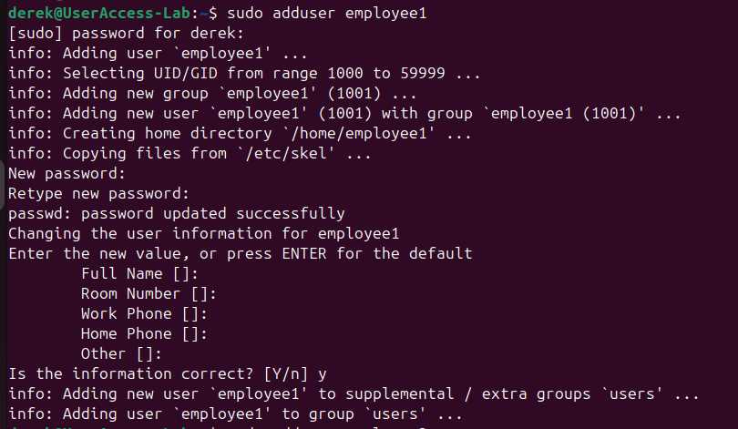
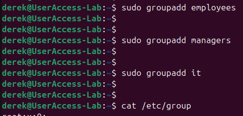
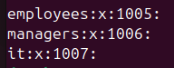
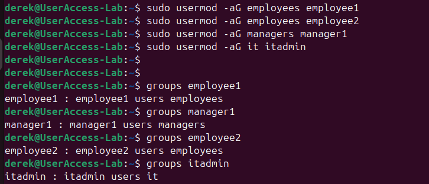
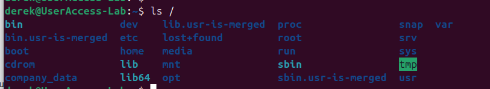
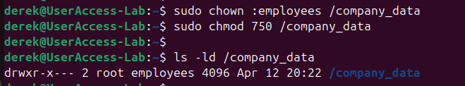
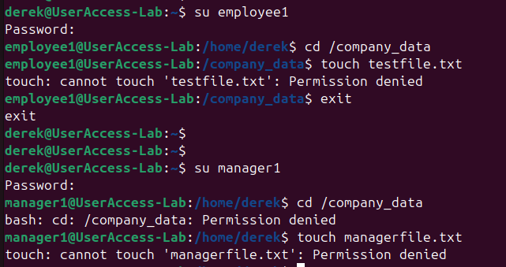
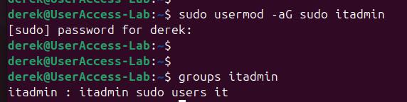
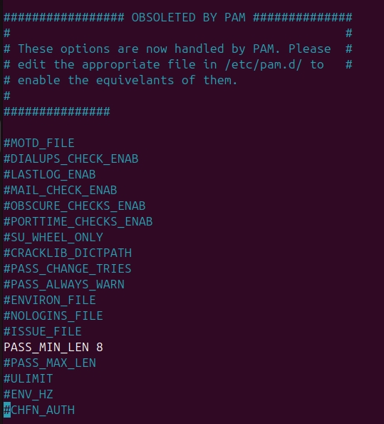
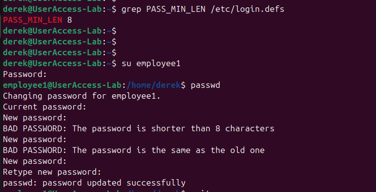

# User Access Management & Security Lab

## Overview
This project simulates a basic enterprise IT environment where I managed user access in a Linux system using an Ubuntu VM in VirtualBox. I created multiple users (employees, manager, IT admin), organized them into role-based groups, and controlled their access through permissions and security policies.

As part of the security implementation, I enforced a password policy requiring a minimum length of 8 characters and tested it by attempting to set a weak password, which was successfully rejected by the system.

## Tools Used
- Ubuntu Linux
- VirtualBox

## Key Features
- Created and managed multiple users (employee1, employee2, manager1, itadmin)
- Organized users into groups (employees, managers, it)
- Implemented Role-Based Access Control (RBAC)
- Verified and configured access to a shared directory (/company_data)
- Applied file permissions to enforce least privilege
- Restricted administrative (sudo) access to IT only
- Configured and tested a password policy (minimum length requirement)

## Screenshots

### User Creation

- Created new user accounts to simulate employees, management, and IT roles within the system.

### Group Creation

- Created role-based groups to organize users and support access control through Role-Based Access Control.

### Group Assignment

- Assigned users to their respective groups to enforce role-based access control.

### Directory Verification

- Verified the existence of the /company_data directory used to store shared resources.
  
### Permissions

- Configured directory permissions to restrict access based on user roles and enforce least privilege.

### Access Testing

- Tested user access by switching accounts and attempting to interact with restricted resources.

### Sudo Access

- Granted administrative privileges only to the IT user to control system-level access.

### Password Policy

- Configured a password policy by modifying the `/etc/login.defs` file to enforce a minimum password length of 8 characters (PASS_MIN_LEN 8). 

### Password Policy Check

- Tested the policy by attempting to set a 3-character password for employee1, which was rejected, confirming the policy was successfully enforced.

## What I Learned
- How to create and manage users in a Linux environment
- How to organize users into groups and apply RBAC
- How file permissions control access to system resources
- How to enforce basic security policies like password requirements
- How to test and validate access control behavior
- Practical experience with Linux commands used in real IT roles

## How I Learned & Applied Linux Commands

During this project, I developed hands-on experience with Linux by learning and applying essential command-line tools and system administration concepts.

### Key Commands Used
- `adduser` – Created and managed user accounts  
- `groupadd` – Established role-based groups (employees, managers, IT)  
- `usermod` – Assigned users to specific groups  
- `chmod` – Configured file permissions to control access  
- `chown` – Set ownership of directories and files  
- `ls` – Verified file structure and permissions  
- `su` – Switched between users to test access controls  
- `passwd` – Managed user authentication and password updates  

### Learning Approach
- Practiced commands directly in a Linux virtual machine environment  
- Tested different configurations to understand permission behavior  
- Troubleshot errors and refined system setup through iterative testing  

This hands-on approach strengthened my understanding of Linux system administration and basic cybersecurity principles.
